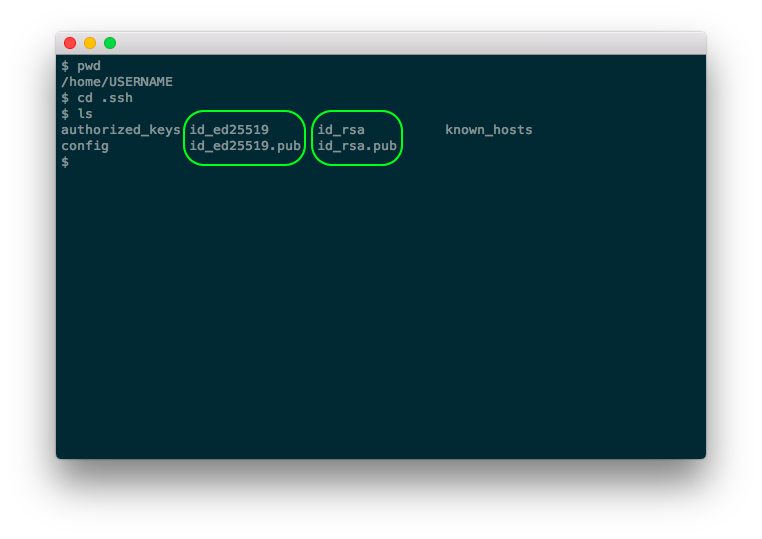

# NAME

**lpassh-add** - Unlocks SSh keys using LastPass

# SYNOPSIS

**lpassh-add** accepts the same arguments as **ssh-add**.

# DESCRIPTION

**lpassh-add** adds SSh keys to the SSh agent, just as **ssh-add**
would, but looks up the passphrases for those keys in LastPass. It only
asks you for the passphrase for a key if it can’t find that passphrase
there.

## Mode of operation

**lpassh-add** calls **ssh-add**, but sets itself as `SSH_ASKPASS` utility.

Consequently, **ssh-add** calls **lpassh-add** again.

**lpassh-add** then:

1. extracts the filename of the private key from the passphrase prompt,
2. uses that filename to locate the corresponding public key file,
3. searches LastPass for a Secure Note that lists that public key, and
4. passes on the passphrase stored in that note to **ssh-add**.

If it doesn’t find the passphrase of a key in LastPass, it asks you for
it.

If you’re not logged into LastPass, but `LPASSH_ADD_USERNAME` is set,
**lpassh-add** logs you into LastPass. It also logs you out again.

## Where to store SSh keys

*Filesystem:* You need to store public and private keys in the same
directory, with the filename of the public key being that of the private
key, save for additionally ending with ‘.pub’. (This is what OpenSSh
does by default.)

*LastPass:* You need to store the passphrase for each of your private
SSh keys in the “Passphrase” field of a so-called Secure Note of the
type “SSH Key”. You also need to store the public key that corresponds
to that private key in the “Public Key” field of that note, so that
**lpassh-add** can identify the entry of that key. Moreover, you need to
place Secure Notes for SSh keys in a folder named “SSh keys”. You can
pick another folder by setting the environment variable
`LPASSH_ADD_LASTPASS_FOLDER`. You can also make **lpassh-add** search
*all* LastPass folders, by setting `LPASSH_ADD_LASTPASS_FOLDER` to the
empty string (""), but this is slow.

# ENVIRONMENT

LPASSH_ADD_LASTPASS_FOLDER  
:   LastPass folder you store your SSh keys in. If you set this variable
    to the empty string (""), then **lpassh-add** will search *all*
    LastPass folders for passphrases. (Default: "SSh keys")

LPASSH_ADD_USERNAME
:   A LastPass username. If set, **lpassh-add** uses this username to log
    you into LastPass if you aren't logged in already.
    (Default: *none*, i.e., don't log into LastPass.)

LPASSH_ADD_KEYS  
:   A colon-separated list of absolute paths to private keys.
    For example: `$HOME/.ssh/id_ed25519:$HOME/.ssh/id_rsa`.
    If set to a non-empty value, **lpassh-add** will ignore other keys.
    (Default: *empty*, i.e., try all keys.)

LPASSH_ADD_IGNORE_KEYS  
:   A colon-separated list of absolute paths to private keys.
    For example: `$HOME/.ssh/id_rsa`. If set to a non-empty value,
    **lpassh-add** will ignore those keys.
    (Default: *empty*, i.e., don’t ignore any key.)

SSH_ASKPASS
:   Utility to ask for passphrases.
    (Default: *none*.)

# SECURITY

**lpassh-add** is but a shell script. You should read the source code and
evaluate the security risks yourself. Above all, since **lpassh-add** is but
a wrapper around OpenSSh and the LastPass command line client, their threat
models apply.

**lpassh-add** itself trusts your system (i.e., your terminal emulator, the
shell, the utilities it calls, etc.), the LastPass command line client, and
your environment. That said, it overrides the environment variables `PATH`,
`IFS`, `LPASS_AGENT_DISABLE`, `LPASS_DISABLE_PINENTRY`, `LPASS_PINENTRY`,
and `LPASS_AUTO_SYNC_TIME`. Moreover, it checks the permissions of the utility
`SSH_ASKPASS` points to.

**lpassh-add** does *not* use the LastPass agent. This is because every
programme that runs under your user (or as the superuser) can get a copy of
your password database while the LastPass agent is running, by calling
`lpass export`. This conforms to their threat model, but it may
still make you feel uneasy.

*Note:* **lpass** reads environment settings from `$HOME/.lpass/env`, so
you can still override these settings.

You should be aware that if you do *not* set `SSH_ASKPASS`, **lpassh-add**
will prompt you for passphrases and read them from the teletype device of your
terminal. However, it does *not* have exclusive access to that device; any
other process that runs under your user (or as the superuser) can also read
from that device. (This is true for *any* programme that prompts you for a
password and reads the answer from a teletype device, including **ssh-add**.)

# CAVEATS

**lpassh-add** ignores your `PATH` and `IFS` as well as some of
LastPass' environment variables (see *SECURITY* above for details).

# AUTHOR

Copyright 2018, 2019, 2020 Odin Kroeger

# SEE ALSO

**lpass**(1), **ssh-add**(1)

<https://github.com/odkr/lpassh-add>
